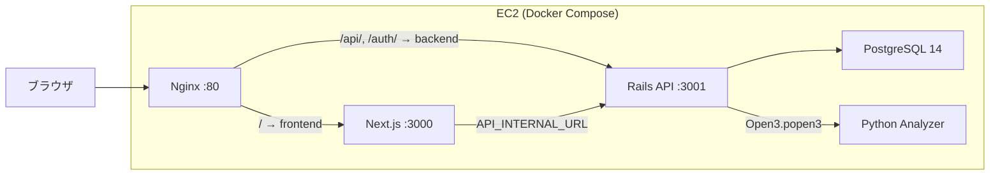
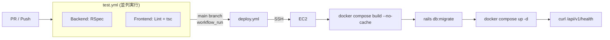
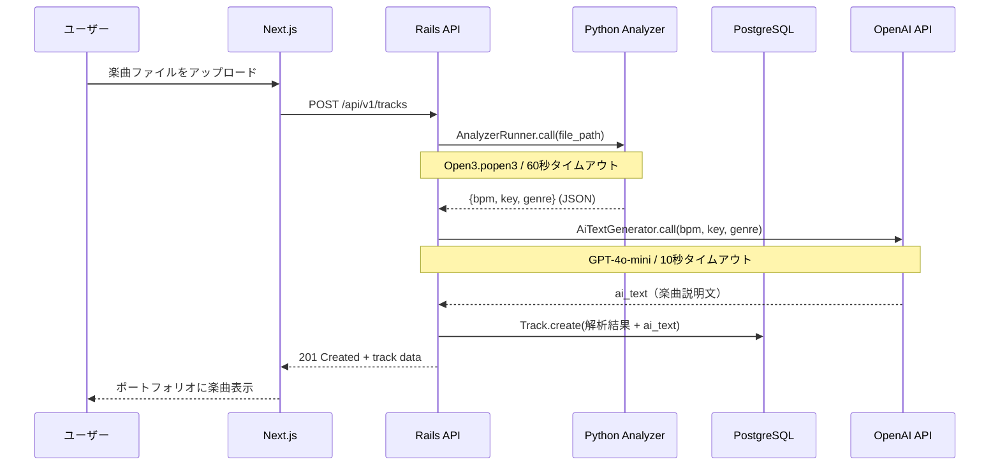
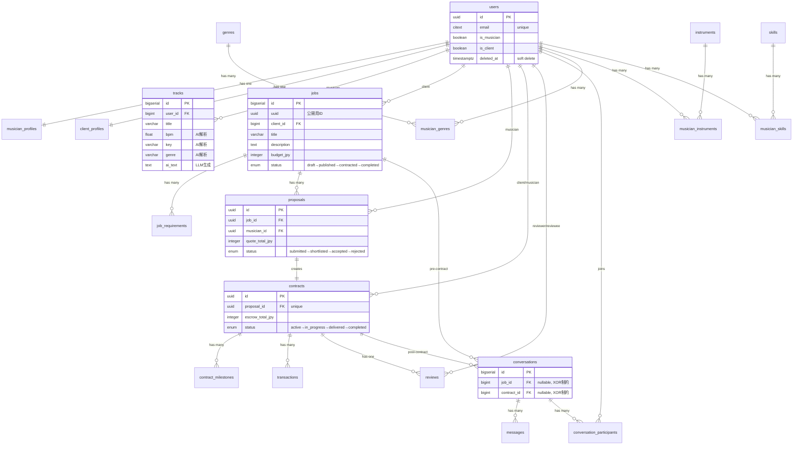

# Music Portfolio AI

**音楽家と制作依頼者を AI でつなぐマッチングプラットフォーム**

[](https://github.com/syo030078/music-portfolio-ai/actions/workflows/test.yml)
[](https://github.com/syo030078/music-portfolio-ai/actions/workflows/deploy.yml)


---

## デモ

**公開 URL**: http://54.250.46.74/

> 📸 スクリーンショットは後日追加予定

<!-- 追加時のフォーマット例:


-->

---

## 主要機能

| 機能 | 概要 | 技術要素 |
|------|------|----------|
| 🎵 楽曲の AI 解析 | アップロードした楽曲の BPM・キー・ジャンルを自動推定 | Python + librosa, Open3 プロセス分離 |
| 🤖 AI 楽曲説明文生成 | 解析データから楽曲の特徴・雰囲気・用途を自動生成 | OpenAI GPT-4o-mini, AiTextGenerator サービス |
| 🔍 AI マッチング | 自然言語で要望を入力 → 最適な楽曲をスコア付きで推薦 | OpenAI GPT-4o-mini, AiMatchingService |
| 📋 ポートフォリオ自動生成 | 解析データから音楽家プロフィールを構築 | Rails API + PostgreSQL |
| 📝 案件管理 | 制作依頼の投稿・提案・契約をステータスマシンで管理 | `draft → published → contracted → completed` |
| 👥 ロールベース UI | ミュージシャン / クライアントで異なる画面・操作を提供 | Next.js App Router + JWT ロール判定 |
| 💬 メッセージング | 依頼者と音楽家のリアルタイムコミュニケーション | RESTful API |
| ⭐ レビューシステム | CHECK 制約（1–5）付きの信頼性あるレーティング | PostgreSQL CHECK 制約 |
| 🔐 認証・認可 | JWT + トークン無効化（denylist）によるセキュアな認証 | Devise JWT + ロールベースアクセス制御 |

---

## 技術スタック

| レイヤー | 技術 | 選定理由 |
|----------|------|----------|
| **Frontend** | Next.js 15 (App Router), React 19, TypeScript strict, Tailwind CSS 4 | RSC + Server Actions によるデータフェッチ最適化。Turbopack で高速開発 |
| **Backend** | Rails 7 API mode, Ruby 3.1.3 | ActiveRecord のマイグレーション管理と充実したモデル層。API mode で軽量化 |
| **Database** | PostgreSQL 14 | UUID ネイティブ対応、CHECK 制約、JSONB。ビジネスロジックの一部を DB 層で保証 |
| **AI / 解析** | Python, librosa, soundfile, NumPy | 音響解析の事実上の標準。Ruby には同等ライブラリがないためサブプロセスとして分離 |
| **LLM** | OpenAI GPT-4o-mini | 楽曲説明文の自動生成 + 自然言語マッチング。コスト効率重視で mini モデルを選定 |
| **認証** | Devise + JWT, bcrypt | SPA + API のステートレス通信に対応。`JwtDenylist` でトークン失効管理 |
| **バリデーション** | Zod | TypeScript の型はコンパイル時のみ → API レスポンスやフォーム入力を実行時にも検証 |
| **Testing** | RSpec (68 spec files), ESLint, TypeScript 型検査 (`tsc --noEmit`) | モデル・リクエスト・サービス・統合テストの多層カバレッジ |
| **Infra** | Docker Compose, nginx, EC2, GitHub Actions | 開発〜本番で同一構成。CI/CD で自動テスト → 自動デプロイ |

---

## アーキテクチャ概要

### システム全体構成



### CI/CD パイプライン



### データフロー（楽曲アップロード）



---

## API エンドポイント設計

RESTful 設計 + UUID 公開キー。内部 `id` を URL に露出させず、`uuid` パラメータでリソースを識別。

| Method | Endpoint | 概要 | 認証 |
|--------|----------|------|------|
| `POST` | `/auth/sign_up` | ユーザー登録 | - |
| `POST` | `/auth/sign_in` | ログイン（JWT 発行） | - |
| `DELETE` | `/auth/sign_out` | ログアウト（トークン denylist 追加） | 🔑 |
| `GET` | `/api/v1/user` | 自分のプロフィール取得 | 🔑 |
| `PUT` | `/api/v1/user` | プロフィール更新 | 🔑 |
| `GET` | `/api/v1/users/:uuid` | 他ユーザーのプロフィール | - |
| `GET/POST` | `/api/v1/tracks` | 楽曲一覧 / 新規アップロード（AI 解析自動実行） | 🔑 |
| `POST` | `/api/v1/tracks/:id/generate_ai_text` | 楽曲の AI 説明文を再生成 | 🔑 |
| `POST` | `/api/v1/matching` | 自然言語 → AI マッチング（スコア付き推薦） | 🔑 |
| `GET/POST` | `/api/v1/jobs` | 案件一覧 / 新規作成 | 🔑 |
| `GET` | `/api/v1/jobs/:uuid` | 案件詳細 | - |
| `GET/POST` | `/api/v1/jobs/:uuid/proposals` | 提案一覧 / 新規提案 | 🔑 |
| `POST` | `/api/v1/proposals/:uuid/accept` | 提案を承認 → 契約自動生成 | 🔑 |
| `POST` | `/api/v1/proposals/:uuid/reject` | 提案を却下 | 🔑 |
| `GET/POST` | `/api/v1/production_requests` | 制作依頼の一覧 / 新規作成 | 🔑 |
| `POST` | `/api/v1/production_requests/:uuid/accept\|reject\|withdraw` | 制作依頼のステータス操作 | 🔑 |
| `GET/POST` | `/api/v1/conversations` | 会話一覧 / 新規作成 | 🔑 |
| `GET/POST` | `/api/v1/conversations/:id/messages` | メッセージ一覧 / 送信 | 🔑 |
| `GET` | `/api/v1/health` | ヘルスチェック | - |

---

## ER 図（16 テーブル）



> 設計ポイント: `conversations` は `job_id` と `contract_id` の XOR 制約で「契約前 / 契約後」の会話を分離。Job や Contract の削除時に CASCADE で会話も削除される。
>
> 詳細な ER 図（全カラム・制約付き）は [`docs/architecture/er-diagram.puml`](docs/architecture/er-diagram.puml) を参照。

---

## 設計判断とトレードオフ

### なぜ Rails API + Next.js の分離構成か（モノリス vs マイクロサービス）

| 選択肢 | メリット | デメリット |
|---------|---------|-----------|
| **Rails モノリス（ERB / Hotwire）** | 開発速度が速い、デプロイが単純 | SPA レベルの UX が困難、フロント技術のアピールが弱い |
| **Next.js フルスタック** | 1 言語で完結 | ActiveRecord の ORM 力・マイグレーション管理を失う |
| ✅ **Rails API + Next.js（採用）** | フロント/バックの責務分離、両方の技術力を証明できる | CORS 設定・認証トークン管理の複雑さが増す |

**判断理由:** 音楽マッチングプラットフォームは「検索 → 試聴 → 提案 → 契約」の対話的な UX が重要。Server Components + App Router でデータフェッチを最適化しつつ、Rails の強力な ORM とマイグレーション管理を活用する構成が最適と判断した。

### なぜ UUID を公開キーに使うか（連番 ID vs UUID）

- 連番 ID を URL に露出すると、`/jobs/1`, `/jobs/2` で他ユーザーのリソースを推測可能（IDOR 脆弱性）
- UUID を公開用、連番 ID を内部用に分離することで、**セキュリティとパフォーマンス（JOIN 効率）を両立**
- PostgreSQL の `pgcrypto` 拡張で DB 層で UUID を生成

### なぜ Python サブプロセスか（FFI vs マイクロサービス vs サブプロセス）

| 選択肢 | メリット | デメリット |
|---------|---------|-----------|
| Ruby FFI で librosa 呼び出し | プロセス間通信なし | librosa は Python 専用。FFI バインディングが存在しない |
| Python マイクロサービス（API） | スケーラブル | インフラコスト増、認証・ヘルスチェックの管理が必要 |
| ✅ **Open3 サブプロセス（採用）** | 最小構成で Python の音響解析ライブラリを活用 | プロセス生成コスト、タイムアウト管理が必要 |

**判断理由:** 音響解析は 1 リクエストあたり 1 回のみ実行。マイクロサービスの運用コストに見合うほどの呼び出し頻度がないため、`Open3.popen3` + 60 秒タイムアウト + `Process.kill` のシンプルな構成を選択。

### なぜ 4 層バリデーションか

```
TypeScript strict → Zod → ActiveRecord validations → PostgreSQL CHECK 制約
```

**トレードオフ:** バリデーションの重複はコードの冗長性を生むが、**各層が独立して動作する**ことで「フロントのバグが DB を壊す」シナリオを構造的に防止。特に `rating` の CHECK 制約（1-5）は、API を直接叩かれても不正値が入らない最終防御ライン。

---

## 技術的こだわり

### 1. API 設計

- RESTful エンドポイント + UUID 公開キーでリソースを識別
- ステータスマシンによる案件ライフサイクル管理（`draft → published → contracted → completed`）
- ページネーション：オフセットベース、最大 50 件/リクエスト

### 2. 認証・認可

- **Devise JWT** によるステートレス認証。セッション管理不要で SPA と相性が良い
- **JwtDenylist テーブル** でログアウト時のトークン即時無効化を実現
- **ロールベースアクセス制御**：ミュージシャン / クライアントで API 権限を分離

### 3. 型安全性の多層防御

```
[TypeScript strict]  →  [Zod schema]  →  [AR validations]  →  [PG CHECK制約]
  コンパイル時            ランタイム          サーバーサイド          DB層
```

- **TypeScript strict mode**: `any` 禁止、CI で `tsc --noEmit` を実行
- **Zod スキーマ**: フォーム入力の実行時バリデーション
- **Rails ActiveRecord validations**: サーバーサイドの制約
- **PostgreSQL CHECK 制約**: DB 層の最終防御（`rating >= 1 AND rating <= 5` 等）

### 4. テスト戦略

- **RSpec 68 ファイル**：モデル（21）・リクエスト・サービス・統合テストの多層構成
- **ESLint + TypeScript 型検査** でフロントエンドの品質を担保
- **GitHub Actions** で全 PR に対して自動テスト実行（RSpec / Lint / tsc 並列）

### 5. 本番構成

- **マルチステージ Docker ビルド**：非 root ユーザー実行、ビルド時依存の除去で軽量イメージ
- **nginx リバースプロキシ**：パスベースルーティング、gzip 圧縮、セキュリティヘッダー付与
- **ヘルスチェック監視**：`curl /api/v1/health` による自動検知
- **PostgreSQL チューニング**：`shared_buffers=64MB`, `effective_cache_size=256MB`, `max_connections=50`

### 6. AI 統合：音響解析 + LLM パイプライン

- librosa による BPM・キー・ジャンル推定を `AnalyzerRunner` サービスに集約
- `Open3.popen3` で Python プロセスを分離し、60 秒タイムアウト + `Process.kill` で暴走を防止
- フォールバック設計：解析失敗時もデフォルト値（BPM=120, Key=C, Genre=Pop）で正常レスポンス
- **`AiTextGenerator`**：OpenAI GPT-4o-mini で解析データから楽曲説明文を自動生成（日本語プロンプト、max_tokens=300）
- **`AiMatchingService`**：クライアントの自然言語要望と全楽曲メタデータを LLM に渡し、マッチ度スコア付きで最大 5 件推薦
- Graceful degradation：API キー未設定や LLM エラー時もアプリ全体は正常動作

---

## 開発環境セットアップ

### Docker Compose（推奨）

```bash
git clone https://github.com/syo030078/music-portfolio-ai.git
cd music-portfolio-ai
cp .env.example .env
docker compose up
```

| サービス | URL |
|----------|-----|
| Frontend | http://localhost:3001 |
| Backend API | http://localhost:3000 |

<details>
<summary>個別セットアップ（Docker を使わない場合）</summary>

#### Backend

```bash
cd backend
bundle install
bin/rails db:setup    # DB作成 + マイグレーション + シードデータ
bin/rails server      # http://localhost:3000
```

#### Frontend

```bash
cd frontend
npm install
npm run dev           # http://localhost:3001
```

環境変数（`frontend/.env.local`）:

```
NEXT_PUBLIC_API_URL=http://localhost:3000
```

#### Analyzer

前提: ffmpeg が必要（macOS: `brew install ffmpeg` / Ubuntu: `sudo apt install ffmpeg`）

```bash
cd analyzer
python -m venv .venv
source .venv/bin/activate
pip install -r requirements.txt
python music_analyzer.py --file path/to/audio.mp3
```

</details>

---

## テスト

```bash
# Backend（RSpec: 68 specファイル）
cd backend && bundle exec rspec

# Frontend（ESLint + TypeScript型検査）
cd frontend && npm run lint && npx tsc --noEmit

# Analyzer
cd analyzer && python test_music_analyzer.py
```

---

## リポジトリ構成

```
music-portfolio-ai/
├── frontend/                # Next.js 15 (App Router, TypeScript, Tailwind CSS 4)
├── backend/                 # Rails 7 API (PostgreSQL, Devise + JWT, RSpec)
├── analyzer/                # Python 音源解析 (librosa, soundfile)
├── infrastructure/          # EC2 デプロイ設定 (nginx.conf, setup.sh)
│   └── ec2/
│       ├── nginx.conf       # リバースプロキシ設定
│       ├── setup.sh         # EC2 初期構築スクリプト
│       └── deploy.sh        # デプロイ実行スクリプト
├── .github/workflows/       # CI/CD
│   ├── test.yml             # RSpec + ESLint + tsc（PR / Push時）
│   └── deploy.yml           # EC2 自動デプロイ（main merge時）
├── docs/                    # 設計資料 (PLAN.md, er-diagram.puml)
├── docker-compose.yml       # 開発環境
└── docker-compose.production.yml  # 本番環境
```

---

## 今後の開発予定

- ✅ 楽曲アップロード + AI 解析（BPM / キー / ジャンル）
- ✅ JWT 認証 + ロールベースアクセス制御
- ✅ 案件投稿・提案・契約管理
- ✅ メッセージング機能
- ✅ レビューシステム（CHECK 制約付き）
- ✅ Docker Compose 本番構成 + EC2 デプロイ
- ✅ CI/CD パイプライン（GitHub Actions）
- ✅ OpenAI 連携による楽曲説明文の自動生成（GPT-4o-mini）
- ✅ AI マッチング（自然言語 → 楽曲推薦）
- ⬜ RAG 実装（pgvector + Embedding によるベクトル検索）
- ⬜ 楽曲の波形表示・プレビュー再生
- ⬜ リアルタイム通知（WebSocket / Action Cable）
- ⬜ 楽曲検索のフィルタリング強化（BPM 範囲・ジャンル）

---

## ライセンス

MIT

*Built with Ruby, JavaScript, Python, and PostgreSQL*
